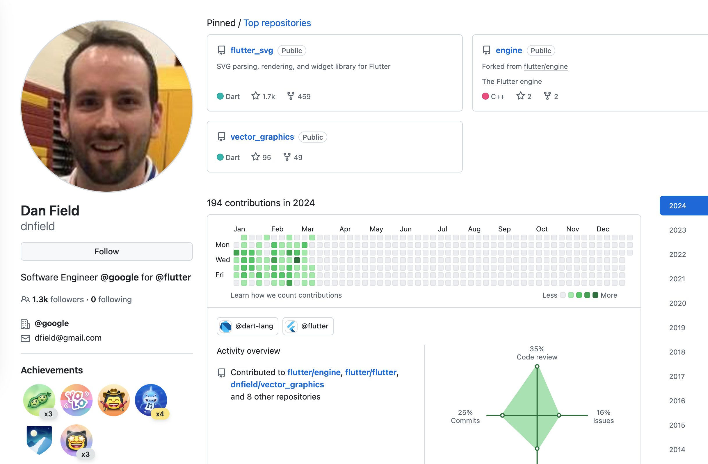
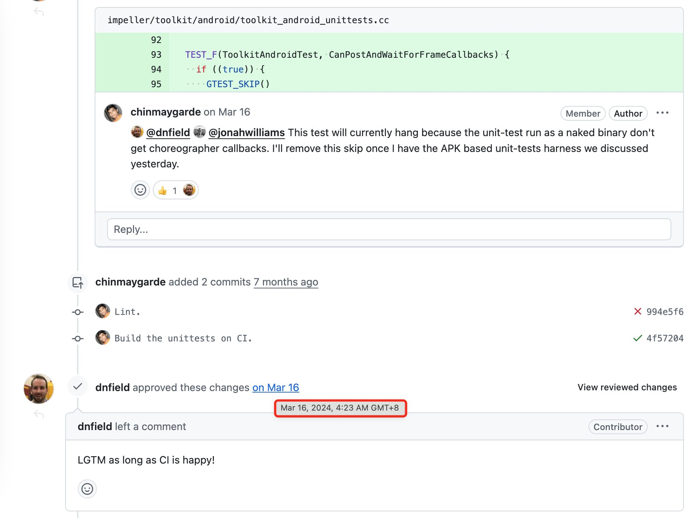
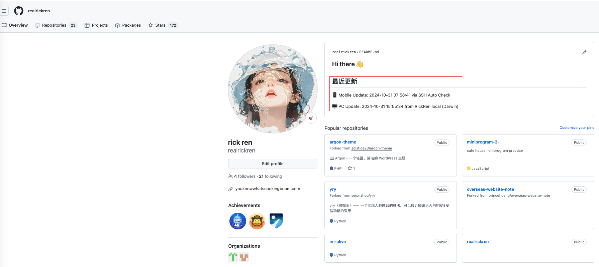

 # I'm Alive 👋

中文 | [English](./README_EN.md)

**注意**: 本项目目前仅实现了 macOS 和 iPhone 的自动更新功能。Windows 和 Android 用户可以参考现有代码，根据各自平台的特性自行实现类似功能。欢迎提交 PR 来支持更多平台！

这是一个告诉世界我还活着的项目。如果你看到这个仓库有最近的更新，说明我一切安好！
2023年全球死亡人口统计数据（根据世界卫生组织WHO的估计）：
总死亡人数: 约6000万人，平均每天死亡人数: 16.4万人。
特别说明：这些数字是估计值
在Github上，经常可以看到一些账号曾经每天都有contribution，但是突然有一天就停止了，就像这样：
  

作为一名开发者，我们每天都活跃在github上，但是可能很少和家人朋友联系。

所以我创建这个项目，每当mac开机或联网、iphone充电时，自动更新README.md，告诉世界我还活着！

## 原理

该项目通过以下方式自动更新README.md：
首先在github上创建两个仓库，其中一个是本项目，另一个是你的github账号同名的仓库（必须是public）用于在你的主页上显示更新。
然后：
- 🖥️ mac端：每次开机或联网时自动运行启动项脚本
  1. 下载pc-client.py并配置:
     ```bash
     # 下载pc-client.py到本地目录
     curl -O https://raw.githubusercontent.com/[your_username]/[repo_name]/main/pc-client.py

     # 首次运行时会提示输入配置信息
     python3 pc-client.py
     ```

  2. 创建run-pc-client.sh脚本:
     ```bash
     # 创建并编辑脚本
     echo '#!/bin/bash
     cd "$(dirname "$0")"
     /usr/bin/python3 pc-client.py' > run-pc-client.sh

     # 添加执行权限
     chmod +x run-pc-client.sh
     ```

  3. 创建启动项plist文件:
     ```bash
     # 创建plist文件
     cat << EOF > ~/Library/LaunchAgents/com.realrickren.imalive.plist
     <?xml version="1.0" encoding="UTF-8"?>
     <!DOCTYPE plist PUBLIC "-//Apple//DTD PLIST 1.0//EN" "http://www.apple.com/DTDs/PropertyList-1.0.dtd">
     <plist version="1.0">
     <dict>
         <key>Label</key>
         <string>com.realrickren.imalive</string>
         <key>ProgramArguments</key>
         <array>
             <string>/path/to/your/run-pc-client.sh</string>
         </array>
         <key>RunAtLoad</key>
         <true/>
         <key>StartInterval</key>
         <integer>3600</integer>
     </dict>
     </plist>
     EOF

     # 加载plist文件
     launchctl load ~/Library/LaunchAgents/com.realrickren.imalive.plist
     ```
  4. 重启电脑或切换网络测试效果

  注意: 请将plist文件中的`/path/to/your/run-pc-client.sh`替换为实际的脚本路径

- 📱 iphone手机：通过快捷指令->自动化->手机充电时触发 通过ssh运行服务器脚本
  1. 将run.sh、mobile-client.py、config.json上传到服务器
  2. 在服务器上创建imalive目录，并将文件上传到该目录，安装python3和PyGithub依赖
  3. 在手机上创建自动化，选择充电时运行
  4. 在自动化中添加ssh运行服务器脚本
  5. 在ssh运行服务器脚本中输入服务器ip、用户名、密码
  6. 在ssh运行服务器脚本中输入服务器上run.sh的路径，例如：/var/www/imalive/run.sh
- 最终效果

## 最近更新

🖥️ PC Update: 2024-11-18 21:49:15 from RickRen.local (Darwin)

📱 Mobile Update: 2024-11-18 09:46:58 via SSH Auto Check
## 关于

这个项目的目的是让我的朋友们知道我一切安好。如果你看到这个仓库超过一周没有更新，可以通过其他方式联系我哦！

### 联系方式

- Telegram: @your_telegram_username
- Email: your.email@example.com
- [其他联系方式]


## 最近更新

🖥️ PC Update: 2024-11-18 21:49:15 from RickRen.local (Darwin)

📱 Mobile Update: 2024-11-18 09:46:58 via SSH Auto Check