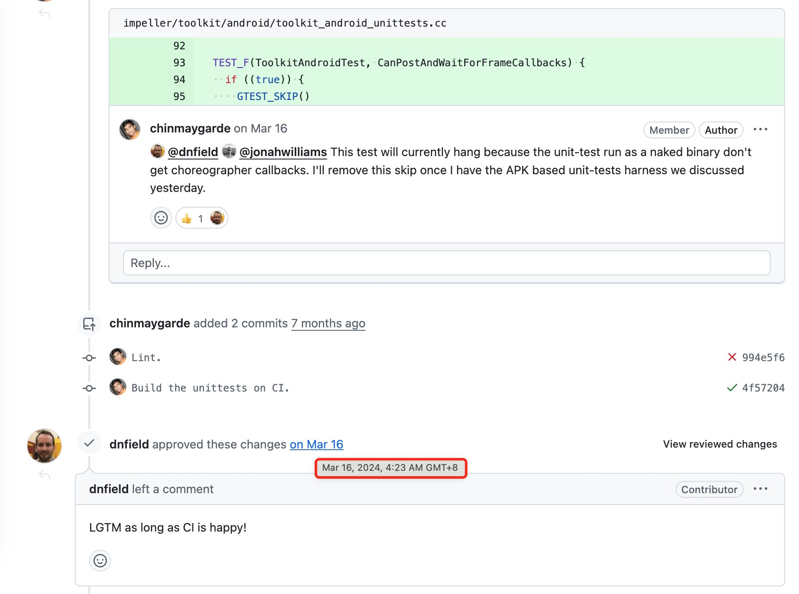
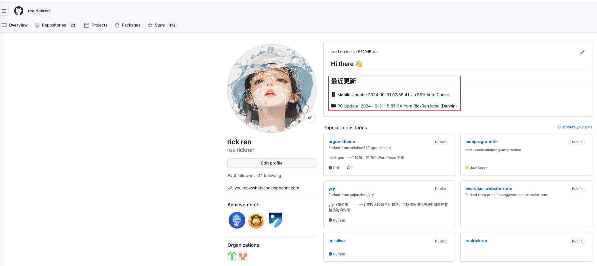

# I'm Alive 👋

[中文](./README.md) | English

 **Note**: This project currently only implements automatic updates for macOS and iPhone. Windows and Android users can refer to the existing code and implement similar functionality based on their platform's characteristics. PRs for supporting more platforms are welcome!

This is a project to tell the world I'm still alive. If you see recent updates in this repository, it means I'm doing well!

According to WHO estimates for global mortality statistics in 2023:
Total deaths: approximately 60 million, with an average of 164,000 deaths per day.
Note: These figures are estimates.

On Github, we often see accounts that had daily contributions but suddenly stopped, like this:
  

As developers, we are active on Github every day but might rarely contact family and friends.

So I created this project to automatically update README.md whenever my Mac boots up or connects to the internet, or when my iPhone charges, to tell the world I'm still alive!

## How It Works

This project automatically updates README.md through:
First, create two repositories on GitHub: one for this project, and another repository with the same name as your GitHub username (must be public) to display updates on your profile page.
Then:
- 🖥️ Mac Client: Automatically runs startup script when computer boots or connects to network
  1. Download pc-client.py and configure:
     ```bash
     # Download pc-client.py to local directory
     curl -O https://raw.githubusercontent.com/[your_username]/[repo_name]/main/pc-client.py

     # First run will prompt for configuration
     python3 pc-client.py
     ```

  2. Create run-pc-client.sh script:
     ```bash
     # Create and edit script
     echo '#!/bin/bash
     cd "$(dirname "$0")"
     /usr/bin/python3 pc-client.py' > run-pc-client.sh

     # Add execute permission
     chmod +x run-pc-client.sh
     ```

  3. Create LaunchAgent plist file:
     ```bash
     # Create plist file
     cat << EOF > ~/Library/LaunchAgents/com.realrickren.imalive.plist
     <?xml version="1.0" encoding="UTF-8"?>
     <!DOCTYPE plist PUBLIC "-//Apple//DTD PLIST 1.0//EN" "http://www.apple.com/DTDs/PropertyList-1.0.dtd">
     <plist version="1.0">
     <dict>
         <key>Label</key>
         <string>com.realrickren.imalive</string>
         <key>ProgramArguments</key>
         <array>
             <string>/path/to/your/run-pc-client.sh</string>
         </array>
         <key>RunAtLoad</key>
         <true/>
         <key>StartInterval</key>
         <integer>3600</integer>
     </dict>
     </plist>
     EOF

     # Load plist file
     launchctl load ~/Library/LaunchAgents/com.realrickren.imalive.plist
     ```
  4. Restart computer or switch network to test

  Note: Replace `/path/to/your/run-pc-client.sh` in the plist file with your actual script path

- 📱 iPhone: Via Shortcuts -> Automation -> Triggered when phone is charging, runs server script through SSH
  1. Upload run.sh, mobile-client.py, config.json to server
  2. Create imalive directory on server, upload files, install python3 and PyGithub dependency
  3. Create automation on phone, select "When Charging"
  4. Add SSH command to run server script
  5. Enter server IP, username, password in SSH command
  6. Enter server script path, e.g.: /var/www/imalive/run.sh
- Final effect


## Recent Updates

🖥️ PC Update: 2024-10-31 14:23:42 from RickRen.local (Darwin)

📱 Mobile Update: 2024-10-31 06:19:46 via SSH Auto Check

## About

The purpose of this project is to let my friends know I'm doing well. If you see this repository hasn't been updated for over a week, feel free to contact me through other means!

### Contact

- Telegram: @your_telegram_username
- Email: your.email@example.com
- [Other contact methods]
